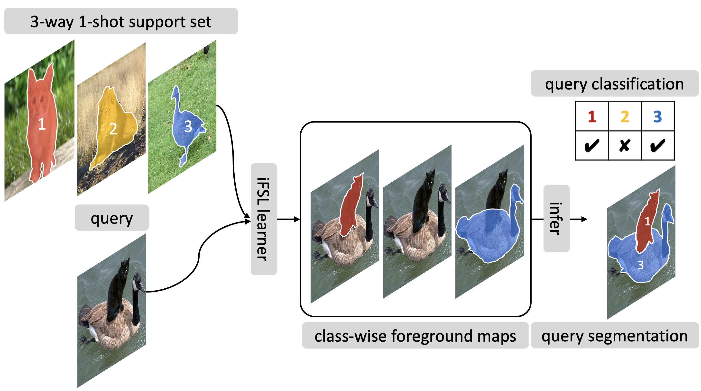

<div align="center">
  <h1> Integrative Few-Shot Learning <br> for Classification and Segmentation</h1>
</div>

<div align="center">
  <h3><a href=http://dahyun-kang.github.io>Dahyun Kang</a> &nbsp;&nbsp;&nbsp;&nbsp; <a href=http://cvlab.postech.ac.kr/~mcho/>Minsu Cho</a></h3>
</div>
<br />


<div align="center">
  <a href="https://arxiv.org/abs/2203.15712"></a>
  <a href="http://cvlab.postech.ac.kr/research/iFSL"></a>
</div>
<br />

<div align="center">
  
</div>

This repo is the official implementation of the CVPR 2022 paper: [Integrative Few-Shot Learning for Classification and Segmentation](https://arxiv.org/abs/2203.15712).


## :scroll: BibTex source
If you find our code or paper useful, please consider citing our paper:

```BibTeX
@inproceedings{kang2022ifsl,
  author   = {Kang, Dahyun and Cho, Minsu},
  title    = {Integrative Few-Shot Learning for Classification and Segmentation},
  booktitle= {Proceedings of the {IEEE/CVF} Conference on Computer Vision and Pattern Recognition (CVPR)},
  year     = {2022}
}
```


## :gear: Conda environmnet installation
This project is built upon the following environment:
* [Ubuntu 16.04](https://ubuntu.com/download)
* [Python 3.7](https://pytorch.org)
* [CUDA 11.0](https://developer.nvidia.com/cuda-toolkit)
* [PyTorch 1.7.0](https://pytorch.org)

The package requirements can be installed via `environment.yml`, which includes
* [`pytorch`](https://pytorch.org)==1.7.0
* [`torchvision`](https://pytorch.org/vision/stable/index.html)==0.8.1
* [`cudatoolkit`](https://developer.nvidia.com/cuda-toolkit)==11.0.3
* [`pytorch-lightning`](https://www.pytorchlightning.ai/)==1.3.8
* [`einops`](https://einops.rocks/pytorch-examples.html)==0.3.0
```bash
conda env create --name ifsl_pytorch1.7.0 --file environment.yml -p YOURCONDADIR/envs/ifsl_pytorch1.7.0
conda activate ifsl_pytorch1.7.0
```
Make sure to replace `YOURCONDADIR` in the installation path with your conda dir, e.g., `~/anaconda3`

## :books: Datasets
* [PASCAL VOC 2012](http://host.robots.ox.ac.uk/pascal/VOC/voc2012/) and [SBD](http://home.bharathh.info/pubs/codes/SBD/download.html)
* [Microsoft COCO 2014](https://cocodataset.org/#download)

Download the datasets by following the file structure below and set `args.datapath=YOUR_DATASET_DIR`:

```
    YOUR_DATASET_DIR/
    ├── VOC2012/
    │   ├── Annotations/
    │   ├── JPEGImages/
    │   ├── ...
    ├── COCO2014/
    │   ├── annotations/
    │   ├── train2014/
    │   ├── val2014/
    │   ├── ...
    ├── ...
```

We follow the dataset protocol of [HSNet](https://github.com/juhongm999/hsnet) and [PFENet](https://github.com/dvlab-research/PFENet).


## :mag: Related repos
Our project refers to and heavily borrows some the codes from the following repos:

* [[PANet]](https://github.com/kaixin96/PANet): Wang _et al_.,  Few-shot image semantic segmentation with prototype alignment, ICCV'19.
* [[PFENet]](https://github.com/dvlab-research/PFENet): Tian _et al_., Prior guided feature enrichment network for few-shot segmentation, TPAMI'20.
* [[HSNet]](https://github.com/juhongm999/hsnet):  Min _et al_., Hypercorrelation squeeze for few-shot segmentation, ICCV'21.


## :bow: Acknowledgements
This work was supported by Samsung Advanced Institute of Technology (SAIT) and also by Center for Applied Research in Artificial Intelligence (CARAI) grant funded by DAPA and ADD (UD190031RD).
We also thank [Ahyun Seo](https://github.com/ahyunSeo) and [Deunsol Jung](https://github.com/hesedjds) for their helpful discussion.
