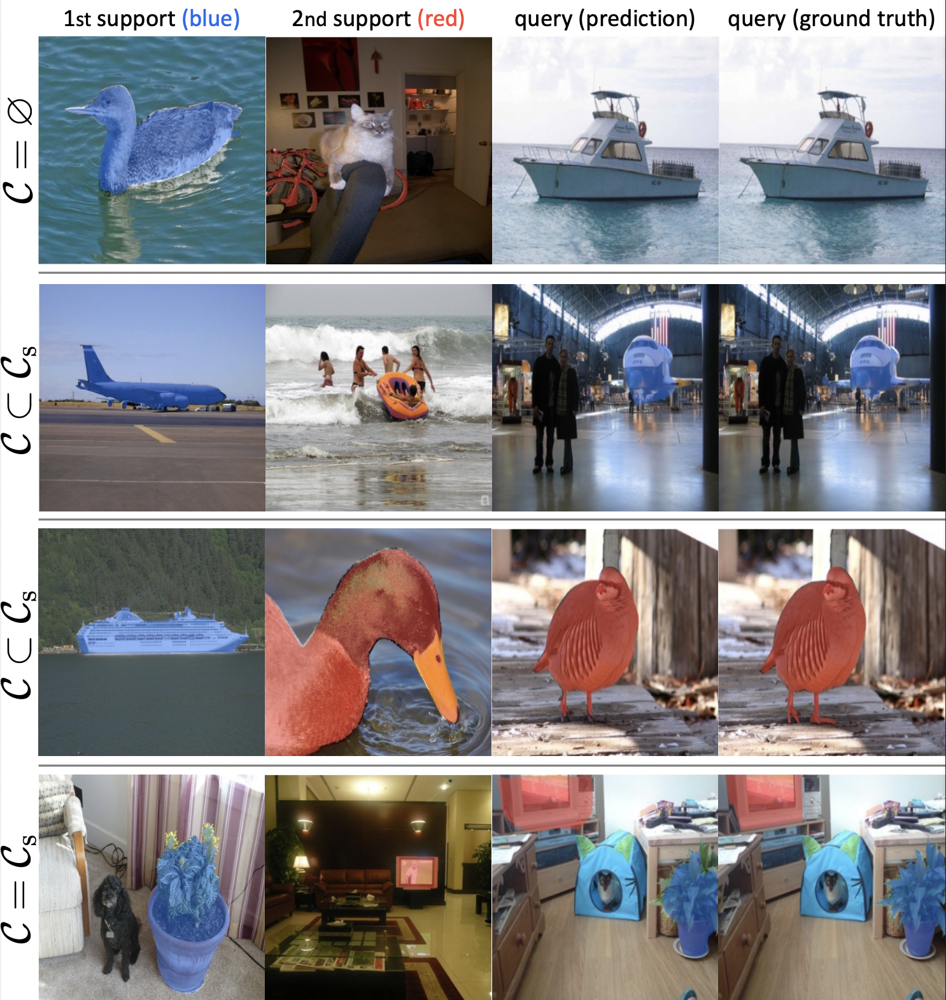

# Integrative Few-Shot Learning for Classification and Segmentation
Target task: integrative few-shot classification and segmentation

<hr>


## :deciduous_tree: Download authors' checkpoints
Download the checkpoint folder `logs/` from this One Drive link [[here]](https://postechackr-my.sharepoint.com/:f:/g/personal/kjdr86_postech_ac_kr/El0fikDWJmBLqdJTqGvxurcBecvl8_dUdVqY6P0Xo__iiA?e=JCkqoM).

The file structure should be as follows:


    ifsl/
    ├── fs-cs
    │   ├──  common/
    │   ├──  data/
    │   ├──  model/
    │   ├──  logs/
    │   ├──  main.py
    │   └──  README.md
    ├── fs-s
    ├── environment.yml
    └── README.md


## :fire: Training a model
### Training with segmentation annotaiton (strong labels)
```bash
python main.py --datapath YOUR_DATASET_DIR \
               --method {panet, pfenet, hsnet, asnet} \
               --benchmark {pascal, coco} \
               --logpath YOUR_DIR_TO_SAVE_CKPT \
               --way 1 \
               --shot 1 \
               --fold {0, 1, 2, 3} \
               --backbone {resnet50, resnet101}
```
Training ASNet on Pascal-5<sup>i</sup> takes 3 days to converge with 2 TitanXPs, and 6 days for COCO-20<sup>i</sup> with 4 TitanXPs and a double size of batch.

### Training with class tag supervision (weak labels)
Append these two arguments: `--weak --lr 1e-4`.


## :pushpin: Quick start: Evaluating authors' checkpoints

```bash
python main.py --datapath YOUR_DATASET_DIR \
               --method {panet, pfenet, hsnet, asnet} \
               --benchmark {pascal, coco} \
               --logpath {panet, pfenet, hsnet, asnet} \
               --way {1, 2, 3, 4, 5} \
               --shot {1, 5} \
               --bsz 1 \
               --fold {0, 1, 2, 3} \
               --backbone {resnet50, resnet101} \
               --eval
```

To evaluate the `asnet-pascal-1way-1shot-resnet50-fold0` model, run:
```bash
python main.py --datapath YOUR_DATASET_DIR \
               --method asnet \
               --benchmark pascal \
               --logpath asnet \
               --way 1 \
               --shot 1 \
               --bsz 1 \
               --backbone resnet50 \
               --fold 0 \
               --eval
```


## :art: Few-shot classification and segmentation results
### Experimental results on Pascal-5<sup>i</sup> datasets on the FS-CS task.

<table>
  <tr>
    <td colspan="5" align="center"><strong>Performance results</strong></td>
    <td colspan="4" align="center"><strong>Links to download checkpoints</strong></td>
  </tr>
  <tr>
    <td>methods</td>
    <td colspan="2" align="center">1-way 1-shot</td>
    <td colspan="2" align="center">2-way 1-shot</td>
    <td colspan="4" align="center">4-fold validation folds</td>
  </tr>
  <tr>
    <td>metric</td>
    <td>cls. 0/1 ER</td>
    <td>seg. mIoU</td>
    <td>cls. 0/1 ER</td>
    <td>seg. mIoU</td>
    <td>fold0</td>
    <td>fold1</td>
    <td>fold2</td>
    <td>fold3</td>
  </tr>
  <tr>
    <td>PANet</td>
    <td align="center">69.0</td>
    <td align="center">36.2</td>
    <td align="center">50.9</td>
    <td align="center">37.2</td>
    <td align="center"><a href="https://postechackr-my.sharepoint.com/:u:/g/personal/kjdr86_postech_ac_kr/ER3fBqs4iKlDhEz0C_b_NngB6bPD2SoA6jVFlfWTU2ldQw?e=bTUtKH">link</a></td>
    <td align="center"><a href="https://postechackr-my.sharepoint.com/:u:/g/personal/kjdr86_postech_ac_kr/Ee9au2cdjA5LuF_xlIGu4nQBC_PhanzXFCqXlqLUENqzdw?e=kmWctH">link</a></td>
    <td align="center"><a href="https://postechackr-my.sharepoint.com/:u:/g/personal/kjdr86_postech_ac_kr/ES5uUrTAmoRIrxk90lTjwEsBDDZ6MXOHUdCjSwGri4Svsg?e=rxYpUB">link</a></td>
    <td align="center"><a href="https://postechackr-my.sharepoint.com/:u:/g/personal/kjdr86_postech_ac_kr/EbW1KydUYF9Fup_wC9Kq43YBj_XFUrrKWCi_DPbl3D0JDQ?e=laqxhu">link</a></td>
  </tr>
  <tr>
    <td>PFENet</td>
    <td align="center">74.6</td>
    <td align="center">43.0</td>
    <td align="center">41.0</td>
    <td align="center">35.3</td>
    <td align="center"><a href="https://postechackr-my.sharepoint.com/:u:/g/personal/kjdr86_postech_ac_kr/EUygG7W6RQVDmrF2mEpuN6IBLzuz0sXhtg-sLrqaIplGOQ?e=Q1JqVZ">link</a></td>
    <td align="center"><a href="https://postechackr-my.sharepoint.com/:u:/g/personal/kjdr86_postech_ac_kr/EVlxKFB-hXBIudhibzk3RCkBAFtsTf_0oZrpQw0azueMMQ?e=9NLu78">link</a></td>
    <td align="center"><a href="https://postechackr-my.sharepoint.com/:u:/g/personal/kjdr86_postech_ac_kr/EfoC1TR6i6tOieQ8AYo67h4BnP2OFYMRQLOQ4vf1WaLjrQ?e=pIlI4p">link</a></td>
    <td align="center"><a href="https://postechackr-my.sharepoint.com/:u:/g/personal/kjdr86_postech_ac_kr/EY7iiZsz6OVHhS4_I1MoD3gBJ8GIqNEG7Tu_OyJEnwWQog?e=b2jSD0">link</a></td>
  </tr>
  <tr>
    <td>HSNet</td>
    <td align="center">83.7</td>
    <td align="center">49.7</td>
    <td align="center">67.3</td>
    <td align="center">43.5</td>
    <td align="center"><a href="https://postechackr-my.sharepoint.com/:u:/g/personal/kjdr86_postech_ac_kr/EU0G5WHy55ZKpe64xME7FYoBJTCuiCKhpvz76PksTIihGg?e=779yiQ">link</a></td>
    <td align="center"><a href="https://postechackr-my.sharepoint.com/:u:/g/personal/kjdr86_postech_ac_kr/EcSHlaVcKWVHj4a1ziH7wnsBSb5U15nKOmJ8coTttLFOSw?e=3dwejE">link</a></td>
    <td align="center"><a href="https://postechackr-my.sharepoint.com/:u:/g/personal/kjdr86_postech_ac_kr/EeBNPNfn3btOmqzYrTg_AO8Bry_5pdpMRHWd4zExL_7M8g?e=v4iKQa">link</a></td>
    <td align="center"><a href="https://postechackr-my.sharepoint.com/:u:/g/personal/kjdr86_postech_ac_kr/EbGtbcjQRIlBtUkjNnpmFlABkOyOMBEYfRhQn4vHQ4x-Yg?e=kWVyI5">link</a></td>
  </tr>
  <tr>
    <td><strong>ASNet</td>
    <td align="center"><strong>84.9</td>
    <td align="center"><strong>52.3</td>
    <td align="center"><strong>68.3</td>
    <td align="center"><strong>47.8</td>
    <td align="center"><a href="https://postechackr-my.sharepoint.com/:u:/g/personal/kjdr86_postech_ac_kr/EflCyuDUUWZDm-9us5PCRYQBg-K3Qtl1tUpP1V6u2PnAwg?e=ldQNXY">link</a></td>
    <td align="center"><a href="https://postechackr-my.sharepoint.com/:u:/g/personal/kjdr86_postech_ac_kr/EQc_JznzLOpKrXOrw_tu-uEBqdDNTTvjs1ymPwu8bQukIA?e=enpBRQ">link</a></td>
    <td align="center"><a href="https://postechackr-my.sharepoint.com/:u:/g/personal/kjdr86_postech_ac_kr/EUuz1mpwCXJDncO7_L8i-t8BzG_j8aoMUhr9W5SvN6mQpA?e=k1Hstw">link</a></td>
    <td align="center"><a href="https://postechackr-my.sharepoint.com/:u:/g/personal/kjdr86_postech_ac_kr/EbH9mzV1t_5Cu-9VcHsO8eEBr9Sl1MTWzDxkcrSAk-AS1Q?e=bHKNhD">link</a></td>
  </tr>
</table>


### Experimental results on COCO-20<sup>i</sup> datasets on the FS-CS task.

<table>
  <tr>
    <td colspan="5" align="center"><strong>Performance results</strong></td>
    <td colspan="4" align="center"><strong>Links to download checkpoints</strong></td>
  </tr>
  <tr>
    <td>methods</td>
    <td colspan="2" align="center">1-way 1-shot</td>
    <td colspan="2" align="center">2-way 1-shot</td>
    <td colspan="4" align="center">4-fold validation folds</td>
  </tr>
  <tr>
    <td>metric</td>
    <td>cls. 0/1 ER</td>
    <td>seg. mIoU</td>
    <td>cls. 0/1 ER</td>
    <td>seg. mIoU</td>
    <td>fold0</td>
    <td>fold1</td>
    <td>fold2</td>
    <td>fold3</td>
  </tr>
  <tr>
    <td>PANet</td>
    <td align="center">66.7</td>
    <td align="center">25.2</td>
    <td align="center">48.5</td>
    <td align="center">23.6</td>
    <td align="center"><a href="https://postechackr-my.sharepoint.com/:u:/g/personal/kjdr86_postech_ac_kr/EfgJWNUDI51FssJAsWLHAlUBKLGuXA6sJ0dauV7GEiyJag?e=kcEzFm">link</a></td>
    <td align="center"><a href="https://postechackr-my.sharepoint.com/:u:/g/personal/kjdr86_postech_ac_kr/EU6bl8Q_UT1AombkrlURbIgBDImFxujyEGAhjbxTYD048Q?e=Ax7kPX">link</a></td>
    <td align="center"><a href="https://postechackr-my.sharepoint.com/:u:/g/personal/kjdr86_postech_ac_kr/EdhTHAt9DXRIhJljLwnNygkBlSZh0fKTSGQQlkCrRgT4kg?e=MphqbR">link</a></td>
    <td align="center"><a href="https://postechackr-my.sharepoint.com/:u:/g/personal/kjdr86_postech_ac_kr/EdLS8_ZsNn9AoWeoOPZaUY8B9Vb4Ympc0k9gQv36te-0ig?e=A5Kbau">link</a></td>
  </tr>
  <tr>
    <td>PFENet</td>
    <td align="center">71.4</td>
    <td align="center">31.9</td>
    <td align="center">36.5</td>
    <td align="center">22.6</td>
    <td align="center"><a href="https://postechackr-my.sharepoint.com/:u:/g/personal/kjdr86_postech_ac_kr/EdH9cNuvdudBv24JBlRl-OYBS1RN2dLAuVJj-QHwxFE2CA?e=RdZXl6">link</a></td>
    <td align="center"><a href="https://postechackr-my.sharepoint.com/:u:/g/personal/kjdr86_postech_ac_kr/EUKXo-i1IydPg4IgLjiHG9IBBARah2Y0gNSk3zJcXgbwVg?e=NBazEw">link</a></td>
    <td align="center"><a href="https://postechackr-my.sharepoint.com/:u:/g/personal/kjdr86_postech_ac_kr/EaMi_nlKQvhNsPL2s-QajoYBV_Hz5otsrDbpgJrv4FlrRw?e=hDcEeq">link</a></td>
    <td align="center"><a href="https://postechackr-my.sharepoint.com/:u:/g/personal/kjdr86_postech_ac_kr/EWnc-nZHNAdCtv5QEO1psGsBdZIlvfwpBapYpVP0OP87NA?e=P3sdOS">link</a></td>
  </tr>
  <tr>
    <td>HSNet</td>
    <td align="center">77.0</td>
    <td align="center">34.3</td>
    <td align="center">62.5</td>
    <td align="center">29.5</td>
    <td align="center"><a href="https://postechackr-my.sharepoint.com/:u:/g/personal/kjdr86_postech_ac_kr/EZZQ9g0eYapGgaRsOrEif-QBPEFRpV7veRrj9GwzE2av8A?e=pdxlri">link</a></td>
    <td align="center"><a href="https://postechackr-my.sharepoint.com/:u:/g/personal/kjdr86_postech_ac_kr/ERwOpzFBJ1xMpNMbvQjps9YB4__Joo5bfOzqobqhocHvOA?e=nFZTFG">link</a></td>
    <td align="center"><a href="https://postechackr-my.sharepoint.com/:u:/g/personal/kjdr86_postech_ac_kr/Ebt5nVQOREJNptdnv4LstkABYq723EbxD5o6T98kumvV1Q?e=eQhozE">link</a></td>
    <td align="center"><a href="https://postechackr-my.sharepoint.com/:u:/g/personal/kjdr86_postech_ac_kr/EYrdn8Y0Rr1NhsPzPxmXyBUBWQEB6cUGr55hV2Sw4_qkAQ?e=izidwn">link</a></td>
  </tr>
  <tr>
    <td><strong>ASNet</td>
    <td align="center"><strong>78.6</td>
    <td align="center"><strong>35.8</td>
    <td align="center"><strong>63.1</td>
    <td align="center"><strong>31.6</td>
    <td align="center"><a href="https://postechackr-my.sharepoint.com/:u:/g/personal/kjdr86_postech_ac_kr/EZFaxVbn5oNErJpqI7NUqqIBvC6awz6PL8rzvZ26OGbi3A?e=mla59Y">link</a></td>
    <td align="center"><a href="https://postechackr-my.sharepoint.com/:u:/g/personal/kjdr86_postech_ac_kr/ERQl3U8iQyZHq8z8es1a7ZMBUB_L82MA4LYCHZnEF9Gyog?e=dVsyYe">link</a></td>
    <td align="center"><a href="https://postechackr-my.sharepoint.com/:u:/g/personal/kjdr86_postech_ac_kr/EXwVcWGBrsJGofB5ifpenIgBJDsYY2tT84A32PF-_jYCCw?e=5e3eiL">link</a></td>
    <td align="center"><a href="https://postechackr-my.sharepoint.com/:u:/g/personal/kjdr86_postech_ac_kr/EbxL8q-j4BZClr2bVw3oAtkBD50pPHoej5SadCIp3nXXBw?e=V3vHYa">link</a></td>
  </tr>
</table>

## :framed_picture: Qualitative examples of the predicted segmentaiton masks
To visualize segmentation prediction of a saved model, use `--eval --vis` options
<br> <br>

